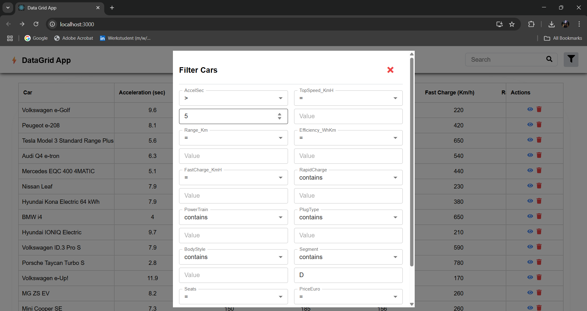
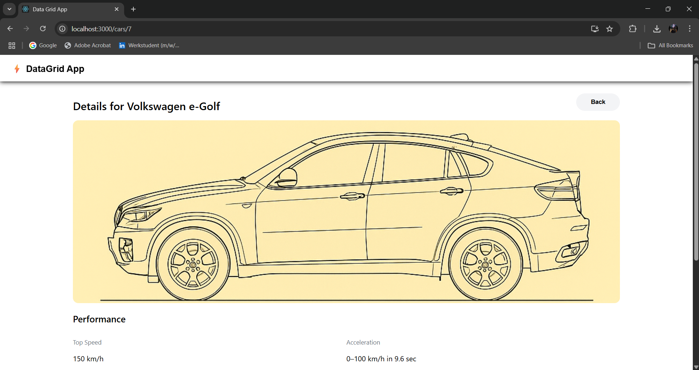

# 🚘 Data Grid App – React + TypeScript + AG Grid + Express

A full-stack TypeScript project that showcases a **generic, reusable data grid** using **React**, **AG Grid**, and **Material UI** on the frontend, with an **Express.js + MySQL** backend API supporting dynamic filtering, searching, viewing, and deleting.

---

## 📸 Screenshots

### 📊 Data Grid View
ots/grid-view.png)

### 🔍 Search & Filter


### 📄 Car Detail Page


> 📁 Put your images inside a `/screenshots` folder in your repo and update the paths above.

---

## 🚀 Features

✅ Generic Data Grid (any number of columns)  
✅ Actions: **View**, **Delete**  
✅ Search cars by keyword  
✅ Filter data with multiple conditions (e.g. contains, equals, greater than)  
✅ Detail view page  
✅ Fully type-safe frontend and backend using TypeScript  

---

## 🧱 Tech Stack

| Layer     | Tech                             |
|-----------|----------------------------------|
| Frontend  | React, TypeScript, MUI, AG Grid  |
| Backend   | Node.js, Express.js, TypeScript  |
| Database  | MySQL                            |

---

## 🗂️ Project Structure

```
data-grid-app/
├── client/              # React frontend
│   └── src/
│       ├── components/
│       ├── pages/
│       ├── services/
│       └── types/
├── server/              # Express backend
│   └── src/
│       ├── routes/
│       ├── db/
│       ├── filters/
│       └── types/
├── screenshots/         # UI screenshots for README
```

---

## ⚙️ Setup Instructions

### 1. Clone the Repository

```bash
git clone https://github.com/shrutiirastogii/data-grid-app.git
cd data-grid-app
```

### 2. Install Dependencies

#### Frontend
```bash
cd client
npm install
```

#### Backend
```bash
cd ../server
npm install
```

### 3. Environment Configuration

Create a `.env` file in the `/server` folder:

```
DB_HOST=localhost
DB_USER=your_user
DB_PASSWORD=your_password
DB_NAME=your_db
PORT=5000
```

### 4. Start the Project

- Start Backend:
```bash
cd server
npm run dev
```

- Start Frontend:
```bash
cd ../client
npm start
```

> App will run at `http://localhost:3000` and backend at `http://localhost:5000`.

---

## 🔌 API Endpoints

| Method | Endpoint                      | Description                   |
|--------|-------------------------------|-------------------------------|
| GET    | `/api/cars`                   | Get all cars                  |
| GET    | `/api/cars/:id`               | Get car by ID                 |
| GET    | `/api/cars/search/:keyword`   | Search by keyword             |
| GET    | `/api/filtercars/filter`      | Filter by column & condition  |
| DELETE | `/api/cars/:id`               | Delete a car by ID            |

---

## 📦 CSV Data

The app uses a dataset loaded from a CSV into MySQL. You can replace this with your own data by updating the import script or loading manually into the `cars` table.

---

## 📽️ Demo Video

> 🔗 Add your video demo link here  
(YouTube, Loom, or Drive)

---

## 📬 Contact

**Author**: Shruti Rastogi
**Email**: shruti.rastogi2501@gmail.com
**GitHub**: [@shrutiirastogii](https://github.com/shrutiirastogii)
**LinkedIn**: [Shruti Rastogi](https://www.linkedin.com/in/shruti-rastogii/)
---
